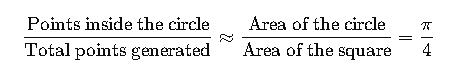

## 01_Islands.py
Given a matrix of 1s and 0s, return the number of "islands" in the matrix. A 1 represents land and 0 represents water, so an island is a group of 1s that are neighboring whose perimeter is surrounded by water.

## 02_best_path_in_matrix.py
Given a matrix of indefinite dimension, take the best reward on it by moving only down or right

## 03_pi_estimation_monte_carlo.py
The Monte Carlo estimation of π using a circle of radius 1 is a probabilistic technique that relies on random simulation to approximate the value of π. 
 
Estimate pi and create animated graph of real-time result (optional)

## 04_polybius_square.py
The Polybius Square cipher is a simple substitution cipher that makes use of a 5x5 square grid. The letters A-Z are written into the grid, with "I" and "J" typically sharing a slot (as there are 26 letters and only 25 slots).
To encipher a message, each letter is merely replaced by its row and column numbers in the grid.
Create a function that takes a plaintext or ciphertext message, and returns the corresponding ciphertext or plaintext.

## 05_knigths_tour.py
A knight's tour is a sequence of moves of a knight on a chessboard such that the knight visits every square exactly once. If the knight ends on a square that is one knight's move from the beginning square (so that it could tour the board again immediately, following the same path), the tour is "closed", or "re-entrant"; otherwise, it is "open"
